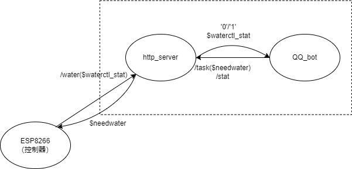

# ShannonGarden
一个用于香农花园的自动灌溉系统。



## 文件夹结构
1. ./arduino中分controller和sensor两个文件夹分别存放ESP8266控制器和传感器的源代码。
2. ./src/plugins中只有garden.py一个文件，为机器人框架中的花园插件源代码。
3. ./weather_data为传感器信息存放文件夹，存放从传感器接收到的温湿度信息。
4. http_server.py为基于Flask的HTTP服务器代码，随机器人框架启动。
5. 其余文件/文件夹为机器人框架自带，具体说明参考其文档（见后文）。README.md为本说明。

## 安装与配置
推荐部署在操作系统为Linux的云服务器上，确保服务24小时在线。没有在Windows下做测试，理论上通用。

QQ机器人分为两个组件，第三方无头QQ客户端（负责接收QQ消息）以及QQ机器人框架（负责执行消息处理逻辑），二者协同工作缺一不可。http_server作为沟通QQ机器人和物联网控制器/传感器的桥梁。

http_server会自动跟随机器人框架启动，下面对QQ机器人中两个组件的部署（安装）进行分别描述。

### 无头QQ客户端
这里使用的是go-cqhttp，请从[go-cq代码仓库](https://github.com/Mrs4s/go-cqhttp)的release页面下载最新对应架构和操作系统的版本。

程序下载完成后，请按照[go-cq文档](https://github.com/Mrs4s/go-cqhttp/blob/master/docs/config.md)中的说明配置登录账号：
1. 启动一次go-cqhttp，键盘输入数字选择**反向WebSocket通信方式**并回车确认，软件会自动生成模板文件**config.yml**。
2. 在**config.yml**文件中配置登录账号和密码，此处的QQ号将作为机器人账号，建议使用小号而非自己的常用账号。其中servers条目下的universal按下面的方式配置，配置无头QQ和机器人框架的通信方式为反向Websocket，地址是本地6565端口。
```
servers:
  - ws-reverse:
      universal: ws://127.0.0.1:6565/cqhttp/ws
      api: ws://your_websocket_api.server
      event: ws://your_websocket_event.server
      reconnect-interval: 3000
      middlewares:
        <<: *default # 引用默认中间件
```
如果您使用docker进行部署，请将配置文件等映射到容器内的`/data`目录，并对该目录进行持久化。

作为参考，docker-compose.yml可按如下方式写入：

```
version: "3.7"

services:
  go-cqhttp:
    image: silicer/go-cqhttp:latest
    container_name: Garden_gocq
    volumes:
      - ./data:/data
    network_mode: "host"
```

### 机器人框架

安装Python依赖库，在bash中输入： 

```
pip install nb-cli==0.5.4 flask httpx
nb plugin install nonebot_plugin_apscheduler
nb adapter install nonebot-adapter-cqhttp
```

*请注意Nonebot2在a16版本后发生重大API改变，本插件仅支持到a16版本。在安装时请不要安装最新的Nonebot2/nb-cli。

配置插件参数。请按照[插件原理部分](#机器人插件)修改`./src/plugins/garden.py`文件顶部的各项参数，并保存。

## 启动
启动无头QQ：cd到go-cq文件夹，输入`./{go-cq文件名}`。使用docker时请输入`docker compose up` / `docker-compose up`  
启动机器人框架：cd到机器人框架文件夹，再输入 `nb run`  

两方启动不分先后。最终你将会看到下面的提示：  

GO-CQHTTP：
> [2022-05-23 15:10:20] [INFO]: 网络诊断完成. 未发现问题  
> [2022-05-23 15:10:22] [INFO]: 开始尝试连接到反向WebSocket Universal服务器: ws://127.0.0.1:6565/cqhttp/ws  
> [2022-05-23 15:10:22] [INFO]: 已连接到反向WebSocket Universal服务器 ws://127.0.0.1:6565/cqhttp/ws  

Nonebot2：
> 05-23 15:10:22 [INFO] garden | 香农花园机器人已接入  
> 05-23 15:10:22 [INFO] garden | HTTP服务器已启动  
> 05-23 15:10:22 [INFO] garden | 浇水控制器守护进程已启动  

代表机器人启动成功。

## 原理解释
整个灌溉系统分为线上和线下两个部分。线上部分为云服务器上的http_server和QQ机器人，线下为基于ESP8266的物联网传感器和控制器，其中传感器负责监测花园温湿度和雨水情况，控制器负责控制水阀开闭。线上和线下的通信方式为HTTP协议通信，http_server是连接QQ机器人和ESP8266的桥梁。

下面对各个部分的原理和参数进行解释。

### http_server
http_server是一个使用Python Flask框架编写的一个简单的HTTP服务器，负责接收从线下ESP8266发送过来的HTTP查询/汇报请求以及来自QQ机器人的查询/下发任务请求。http_server.py位于机器人框架所在目录的根目录下，会随着机器人的启动通过os.popen()启动。

HTTP服务器提供的API如下表所示。
| API      | Method | Description | Payload | Return
| ---------| ----------- | ----------- |----------- |----------- |
| /upload  | POST |接收来自传感器的温湿度、雨水和潮湿信息 |json|{'val':'success'}或{'val':'failed'}
| /water   | POST |接收来自控制器的浇水任务查询/汇报信息|waterctl_stat|needwater
| /tasks   | POST |接收来自机器人的浇水任务请求      |needwater|"0"或"1"
| /stat    | GET  |接收来自机器人的查询控制器状态请求|- |waterctl_stat

说明：
- /upload接收来自传感器的天气信息（json格式），格式如 `{"temp":"25","humid":"2","rain":"1","wet":"1"}`，分别代表温度、湿度、是否下雨、是否潮湿。服务器接收到信息后，在原有json信息中添加收到信息时的时间戳，并将信息追加写入到代码（http_server.py）顶部设置的CATALOG目录下，提供给机器人查询。
- 服务器接收来自控制器的状态码，保存到全局变量waterctl_stat；接收来自机器人的浇水指令，保存到全局变量needwater。再分别通过/water和/stat的返回值将浇水指令/状态码传递给控制器/机器人，实现二者的信息交换。其中waterctl_stat和needwater的定义如下：  
    - waterctl_stat是一个长度为1或2的字符串，表示控制器的工作状态。  
        | waterctl_stat| Description 
        |---|---|
        |?|控制器离线（默认值）
        |00|控制器在线且空闲。仅第一位有效|
        |1x|控制器正在工作。第二位x代表正在浇灌的区域，如0代表全域，1代表第1区域
    - needwater是一个长度为2的字符串，表示来自机器人的浇水指令。  
        | needwater| Description 
        |---|---|
        |00|当前没有浇水任务（默认值）
        |1x|请求浇水。第二位x代表需要浇灌的区域，如0代表全域，1代表第1区域
        |20|停止浇水
- 默认状态下，控制器每5秒通过/water向服务器查询当前的浇水指令，服务器若超过30秒（WATERCTL_WTD_TIME）没有收到来自控制器的查询请求，则将waterctl_stat设置为?，认为控制器已经离线。
- 服务器默认工作端口（PORT）是5051，HOST设置为0.0.0.0以接收来自互联网的信息。

代码http_server.py中可以配置的参数如下表所示：
|Variable|Description|Default or Example|
|---|---|---|
|CATALOG|用Path()包裹的字符串。存放本地天气信息缓存的位置|Path("./weather_data")
|HOST|字符串。HTTP服务IP地址|0.0.0.0
|PORT|字符串。HTTP服务端口|5051
|WATERCTL_WTD_TIME|整数，单位为秒。代表控制器离线恢复等待时间|30

### 机器人插件
机器人的工作依赖garden插件。机器人框架使用Nonebot2，关于此框架具体使用方法请参考[Nonebot2官方文档](https://61d3d9dbcadf413fd3238e89--nonebot2.netlify.app/)。  
*请注意本插件需要a16及以下版本的Nonebot2，官方文档版本也有所不同。beta1及以后的版本由于框架中的信息处理模式发生变化，导致前后不兼容，由于作者精力问题本插件没有进行移植。

插件代码garden.py位于`{框架根目录}/src/plugins`，插件功能请在管理群内发送“`花园功能`”获取。  

garden.py代码顶部有下面几个配置的参数，在启动前请根据实际情况修改默认值：
|Variable|Description|Default or Example|
|---|---|---|
|CATALOG|用Path()包裹的字符串。代表存放传感器信息的文件夹|Path("./weather_data")
|TARGET_GROUP|整数。代表管理群群号| 990000000
|WATER_AUTHLIST|存放字符串的List。代表可以发出浇水请求的群成员QQ号| ["10000","10001"]
|TASK_TIMEOUT_CHECK|整数，单位为秒。代表浇水任务下发后控制器必须在指定时间后开始浇水，否则会在群里发出消息提示。|30
|WATER_DAEMON_INTERVAL|整数，单位为秒。代表每隔一定时间机器人检查控制器状态是否发出变化，变化时会在群里发出消息提示。|5
|HTTP_SERVER_IP|字符串。代表http_server工作IP|"127.0.0.1"
|HTTP_SERVER_PORT|字符串。代表http_server工作端口|"5051"


### 物联网传感器
以ESP8266为主控端，外接DHT11作为温湿度传感器，和一个雨滴模块。整个模块间`INTERVAL`分钟将温湿度和雨水/潮湿状态信息打包成Json格式，并向服务器`HOST`上报。

关于ESP8266的具体使用方法，推荐观看b站太极创客的[教学视频](https://www.bilibili.com/video/BV1L7411c7jw?share_source=copy_web)。

代码位于`arduino/sensor/sensor.ino`，可以使用Arduino直接打开，安装所需要的库后，配置代码中的`HOST`和`wifiMulti.addAP(WIFI名称, 密码)`，即可编译并向ESP8266烧写程序。

注：如何在Arduino安装所需要的库：
- 在文件-首选项-附加开发板管理器网址中添加 http://arduino.esp8266.com/stable/package_esp8266com_index.json
- 选择工具-开发板-ESP8266 Boards-Generic ESP8266 Module
- 在工具-管理库中搜索并安装ArduinoJson，AsyncHTTPRequest_Generic，SimpleDHT

其中DHT11的引脚对应为：
|DHT11|开发板|代码中对应常量
|---|---|---
|+|3v3|无
|out|D2|DHT11PIN
|-|GND|无

雨滴模块型号不明，雨水落在感应板上会影响其导电性，通过LM393比较器调整阈值，超过一定阈值时认为开始下雨。

雨滴模块引脚对应：
|雨滴模块|开发板|代码中对应常量
|---|---|---
|DO|D5|RAINPIN
|GND|GND|无
|VCC|3V3|无

注：
1. 根据实际需要此模块可能会使用外接电池工作，建议学习ESP8266低功耗模式相关内容并修改代码，以延长续航。
2. ESP8266开发板引脚在代码中的编号并非和其引脚印刷名称中的数字相同，例如开发板的D2引脚在代码中的编号并非为2，而是4。开发板的各个引脚在代码中的实际编号请查阅ESP8266的引脚图/引脚对应，例如D2实际对应的是芯片的GPIO4，在代码中的编号即为4。

### 物联网控制器
以ESP8266为控制端，外接继电器控制12V水阀，水阀均为通电开启断电关闭。由于水泵的压力和进水量有限，实际操作中将花园分为多个区域，由不同的水阀进行控制并进行分区浇水。花园购买的水泵支持随着水阀开闭自动启停。此外，还需要外接一个无源蜂鸣器用于播放洒水音乐。

控制器每隔`CHECKTIME`秒向`SERVER_URL`请求浇水任务信息，接收到开始浇水信息后进入`startWatering()`，修改相关状态位，如果指定全域浇水则从小编号区域开始向大编号区域依次接通继电器，最后完成浇水任务，调用`stopWatering()`修改相关状态位，向服务器报告浇水任务完成。

各个变量和宏定义的说明见代码注释。

编译和烧写前请按照前文[传感器](#物联网传感器)部分下载所需要的库，并且配置好`SERVER_URL`中的IP地址和端口，并在`wifiMulti.addAP(Wifi名称, 密码)`中配置控制器需要接入的Wifi。